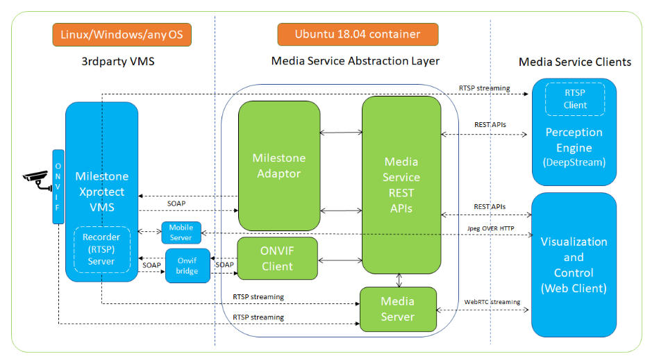
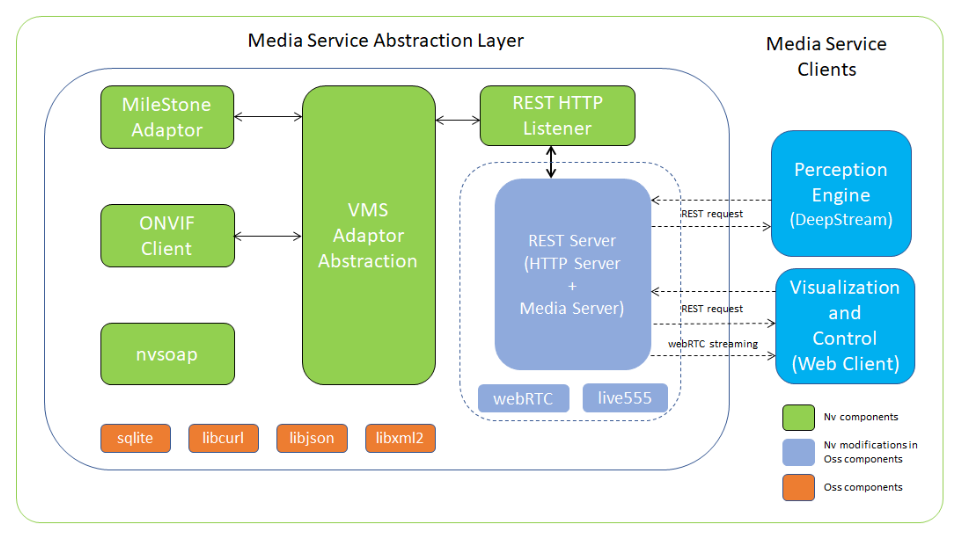
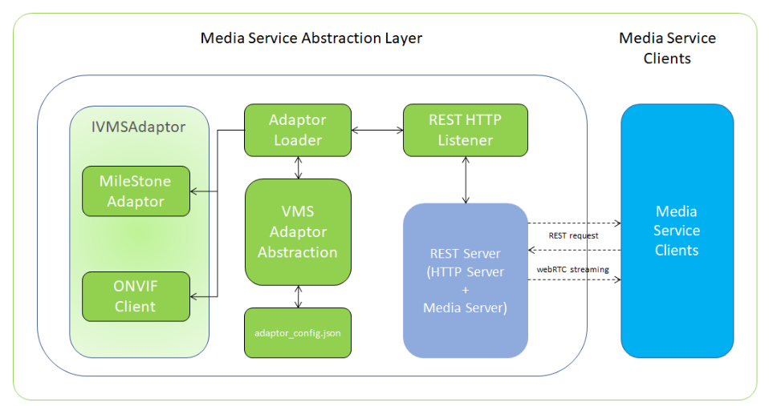
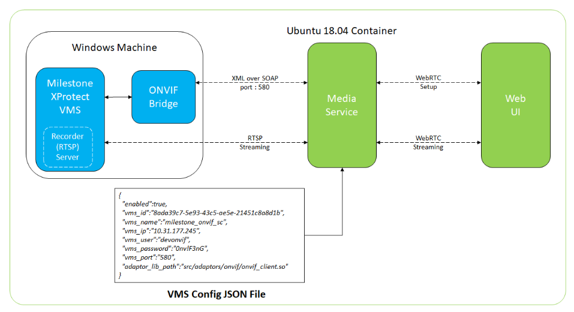
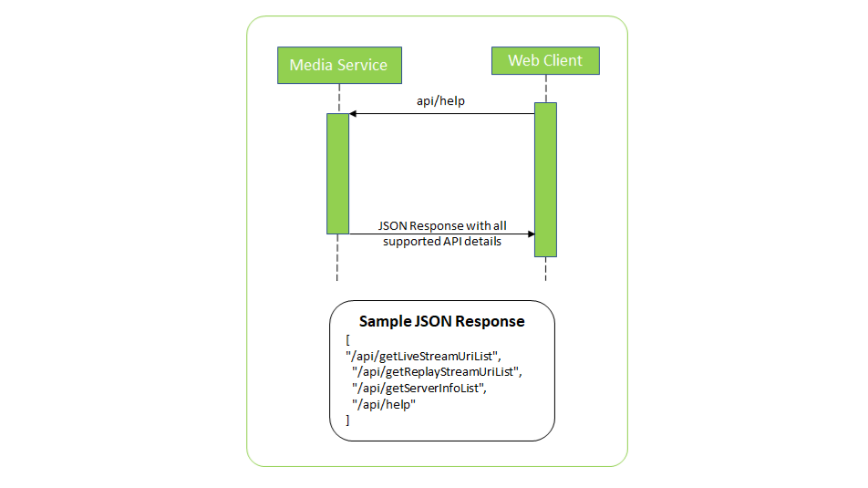
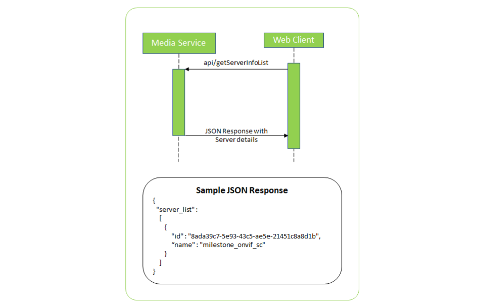
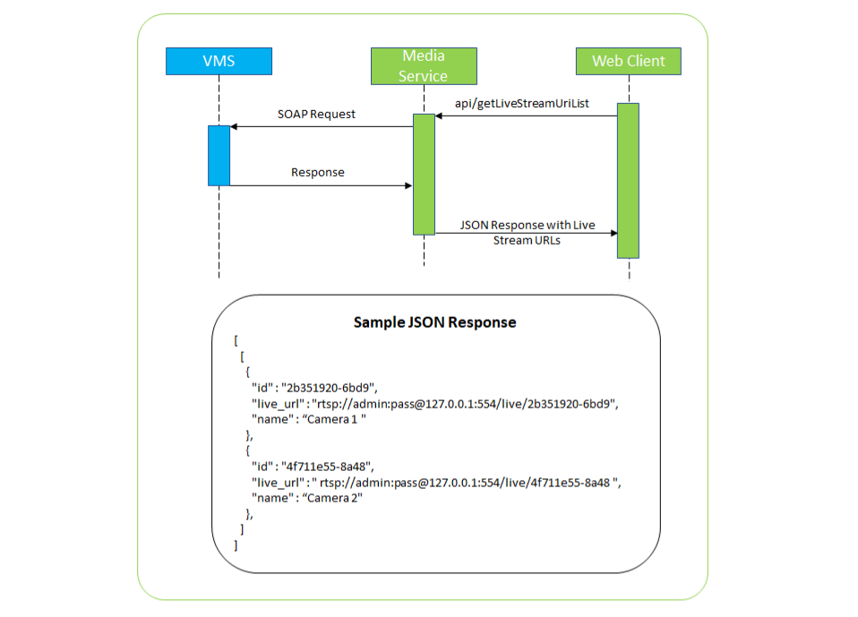
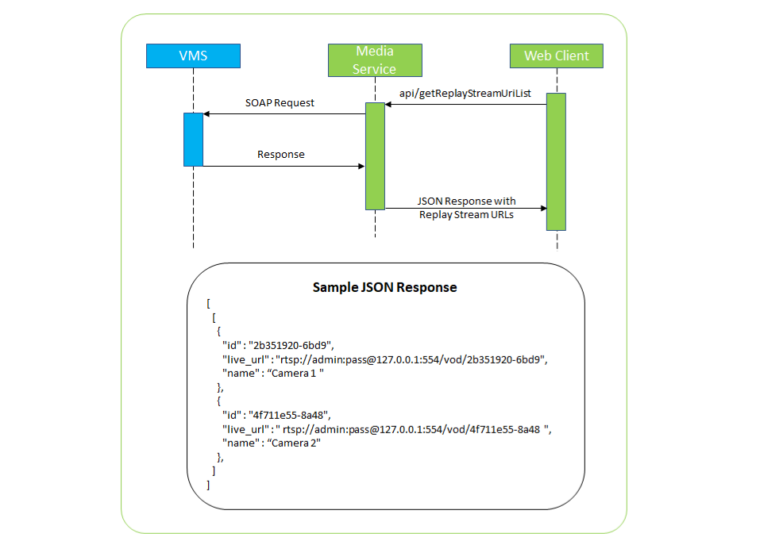
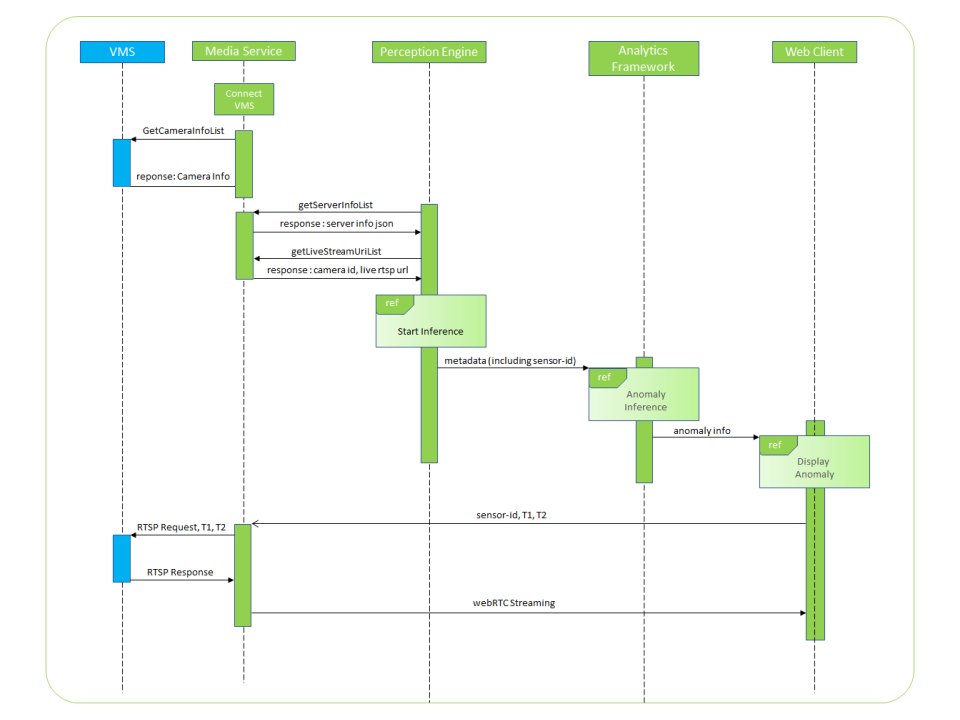
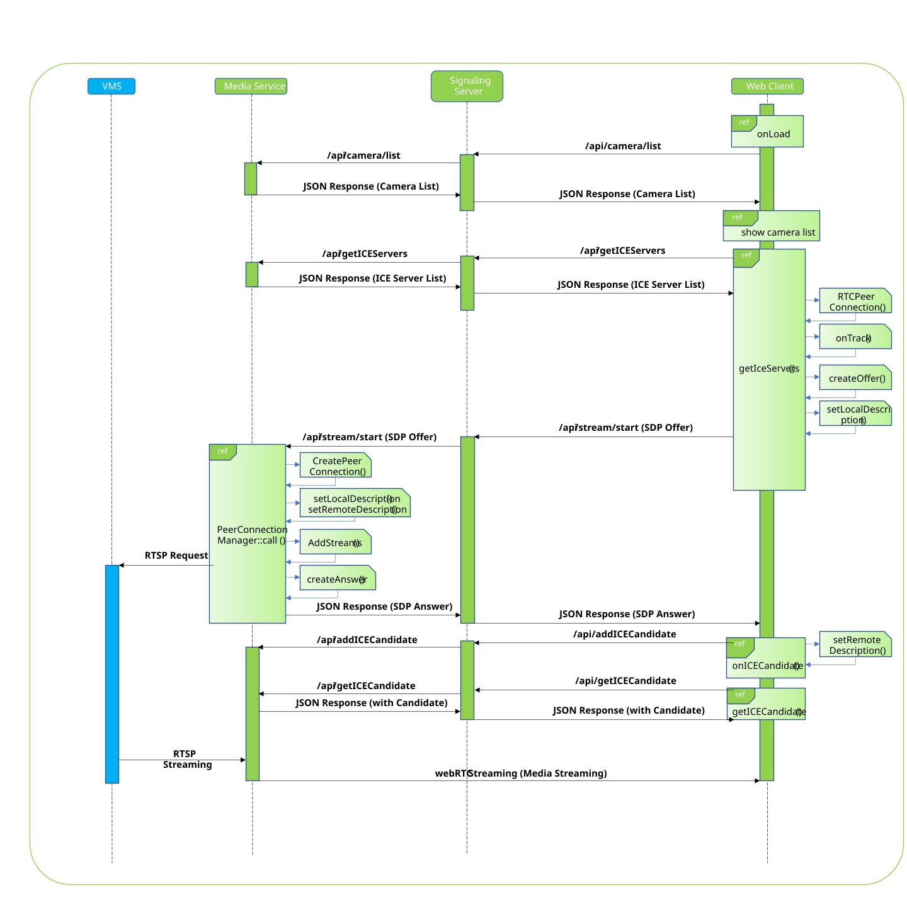

<!--
SPDX-FileCopyrightText: Copyright (c) 2019-2026 NVIDIA CORPORATION & AFFILIATES. All rights reserved.
SPDX-License-Identifier: Apache-2.0
-->

<h1>Media Service</h1>
<h2>Introduction</h2>
<p>Developers creating end to end AI enabled Intelligent Video Analytics solutions need to interact with video management systems (VMS). A VMS is responsible for a few critical tasks in end to end solutions that leverage cameras as sensors. The VMS allows end users to add or remove cameras, configure and control them and create a policy driven storage and archival of the video feeds at appropriate media granularity. The VMS enabes retrieval of previously stored video content. Finally it enables local and remote dashboards to play one or more such streams synchronously.</p>
<p>AI IVA solutions need to access such camera streams in real time streaming analytics as well as retrieval and visualization. Most popular legacy VMS systems do not have easy to use API interfaces for most of the AI pipelines that are generally Unix-based. The Metropolis Data and Analytics toolkit (MDAT) contains a Media Service module that aims to abstract the functionalities of any VMS being used and provide a set of common APIs to Media Service clients.</p>
<h3>Architecture</h3>

<p>Media Service is designed as a scalable project which supports pluggable adaptors/plugins, i.e. we need to write an adaptor code to translate the VMS APIs to Media Service APIs. These pluggable adaptors help to add any 3rd party VMS in Media Service which supports SOAP, REST or any other proprietary APIs.</p>
<h3>Media Service Features</h3>
<ul>
<li>Supports pluggable adaptors to use any 3rd party VMS</li>
<li>Provides a set of REST APIs to interact with VMS</li>
<li>Supports interaction with RTSP Server to fetch live and recorded streams</li>
<li>Converts RTSP video stream to webRTC stream</li>
<li>Provides WebRTC media streaming of live and recorded VMS streams</li>
</ul>
<h3>Internal Modules</h3>

<ul>
<li><strong>Adaptors</strong>: Specific to each third party party VMS i.e. Milestone Adaptor</li>
<li><strong>Media Service</strong><strong>Adaptor Abstraction </strong>: This class translates the VMS protocol to Media Service protocol</li>
<li><strong>HTTP Listener</strong> : This serves as HTTP Listener and forwards the HTTP requests to corresponding modules</li>
<li><strong>HTTP Server </strong>: To serve REST API requests from clients</li>
<li><strong>Third-party Libraries</strong>
<ul>
<li><strong>sqlite </strong>: For database management to store event metadata</li>
<li><strong>libcurl </strong>: REST and SOAP client side library</li>
<li><strong>libjson </strong>: A JSON reader and writer library</li>
<li><strong>libxml2 </strong>: XML C parser</li>
<li><strong>civetweb </strong>: HTTP server used for webrtc signalling</li>
</ul>
</li>
<li><strong>webRTC</strong> : This supports Real-Time Communications (RTC) capabilities in the browser to stream recorded and live videos</li>
<li><strong>live555 </strong>: C++ RTSP client side library</li>
</ul>
<h2>Adding a new Adaptor/plugin</h2>
<p>Media Service supports connections to third party party VMS using pluggable adaptors</p>

<p>To implement a new adaptor:</p>
<ul>
<li>A new VMS Adaptor should implement<strong><em> IVMSAdaptor Class </em></strong>(refer <em>include/vms_adaptor.h</em>)</li>
<li>Implement the following methods
<ul>
<li><strong><em>IVmsAdaptor* createObject();</em></strong>
<ul>
<li><strong><em>return new &lt;vms_Adaptor_class&gt;</em></strong></li>
</ul>
</li>
<li><strong><em>void destroyObject( IVmsAdaptor* object );</em></strong>
<ul>
<li><strong><em>delete &lt;vms_Adaptor_object&gt;</em></strong></li>
</ul>
</li>
<li>Create a new json file or populate the existing json file with the following VMS details
<ul>{ </ul>
<ul>
<ul><em>"<strong>enabled</strong>": &lt; boolean value &gt;,</em></ul>
<ul><em> "<strong>vms_id</strong>": &lt; globally unique id&gt;,</em></ul>
<ul><em> "<strong>vms_name</strong>": &lt; human readable name&gt;,</em></ul>
<ul><em> "<strong>vms_ip</strong>": &lt; IP Address of VMS Server&gt;,</em></ul>
<ul><em> "<strong>vms_user</strong>": &lt; user name&gt;,</em></ul>
<ul><em> "<strong>vms_password</strong>": &lt; password&gt;,</em></ul>
<ul><em> "<strong>vms_port"</strong>: &lt; port number&gt;,</em></ul>
<ul><em> "<strong>adaptor_lib_path</strong>": &lt; path/to/vms/library&gt;</em></ul>
</ul>
<ul>},</ul>
</ul>
</li>
</li>
</ul>

<ul>
<li>Once Media Service is connected to VMS it gets the related information from the third party VMS and Media Service then registers the REST APIs in HTTP server to expose the APIs to clients.</li>
<li>Media Service application provides the following command-line option to specify vst_config.json
<ul>
<li><strong><em>--configFile &lt;path_to_config_json_file&gt;</em></strong></li>
</ul>
</li>
</ul>
<h2>Setup</h2>
<p>This section shows the implementation of Media Service for the popular Milestone VMS.</p>

<p>Media service is deployed in an Ubuntu 18.04 container. The developer needs to prepare vst_config.json filled with required details. This config file should be provided as a command-line argument.</p>

<p>The Milestone VMS installation requires a Windows machine. Milestone Xprotect Corporate version is preferred. Media Service is communicating to Milestone VMS through ONVIF Bridge, so need to install Milestone ONVIF Bridge on the same Windows machine.</p>
<p>Media Service Test WebUI is connected to Media Service Application using webRTC protocol, please refer to the webRTC section below for more details.</p>
<p>For more details with Milestone VMS installation please refer link below<br /><a href="https://doc.milestonesys.com/2020r1/en-US/portal/htm/chapter-page-mc-gsg.htm">https://doc.milestonesys.com/2020r1/en-US/portal/htm/chapter-page-mc-gsg.htm</a></p>

<h2>Build and Launch Media Service</h2>

### A) Build the compilation base container (x86_64)

The base image carries the system packages and toolchain used to compile every module. Build it once, then reuse it for all subsequent module/container builds.

```bash
./build.sh base-container
```

Optional: tag and push the base image to the registry.

```bash
./build.sh base-container base-tag=<base-tag> push=1
```

### B) Build module containers

Build the `sensor` and `streamprocessing` module containers:

```bash
./build.sh container module=streamprocessing,sensor
```

### C) Build the NVStreamer container

```bash
./build.sh nvstreamer container
```

### D) Run Media Service

The compiled images are deployed via docker-compose. See `deployment/1click_README.md` and `deployment/oneclick_dc_deployment_for_dev.py` for the one-click deployment flow.

For all build options, run `./build.sh help`.

<h2>Quick Start</h2>
<p>To quickly test if Media Service is properly set up and launched, one can test it with any web browser or curl command,
launch Media Service and perform any one of below mentioned tests.</p>
<h5>A) Browser</h5>
<ul>
<li>Launch web browser</li>
<li>In the address bar enter IP Address of host on which Media Service is running followed by port number followed by Media Service API to test.
<ul>
<li>Example : <strong><em>&lt;IP_ADDRESS&gt;:&lt;PORT_NUMBER&gt;/api/&lt;API NAME&gt;<br /></em></strong>Sample URL: <a href="http://192.168.1.23:81/api/help"><strong><em>http://192.168.1.23:81/api/help</em></strong></a></li>
</ul>
</li>
<li>It is expected that web browser should print the JSON response received from Media Service</li>
</ul>
<h5>B) Curl Command</h5>
<ul>
<li>Launch Linux Terminal</li>
<li>Execute curl command with IP Address of host on which Media Service is running followed by port number followed by Media Service API to test.
<ul>
<li>Example: <strong><em>curl &lt;IP_ADDRESS&gt;:&lt;PORT_NUMBER&gt;/api/&lt;API NAME&gt;</em></strong><br /> Sample curl command: <strong><em>curl </em></strong><a href="http://192.168.1.23:81/api/help"><strong><em>http://192.168.1.23:81/api/help</em></strong></a></li>
</ul>
</li>
<li>It is expected that the JSON response received from Media Service should be printed in terminal</li>
</ul>
<h2>APIs and Interaction with other Modules</h2>
<h4><strong>Media Service REST APIs to interact with clients</strong></h4>
<ul>
<li><strong><em>api/help</em></strong> : Provides a list of all supported APIs by Media Service</li>


<li><strong><em>api/getServerInfoList </em></strong>: Provides a list of connected VMS servers and relevant details.</li>


<li><strong><em>api/getLiveStreamUriList </em></strong>: Provides a list of live stream RTSP url</li>


<li><strong><em>api/getReplayStreamUriList </em></strong>: Provides a list of recorded stream RTSP urls.</li>


</ul>
<h4><strong>Sequence Diagram to depict interaction between Metropolis Data and Analytics Toolkit (MDAT) Components</strong></h4>
<p>A common requirement in end to end application development that the Metropolis Data and Analytics Toolkit (MDAT) enables is the ability for the analytics framework to detect events of interest such as anomalies, based on the metadata extracted by the perception pipeline (such as NVIDIA Deepstream) and the ability to fetch a specific video clip from the VMS corresponding to this detected event or anomaly. The sequence diagram below explains how this flow works with the various MDAT modules working together.</p>


<ul>
<li>Media Service connects to VMS and gets the camera info list from 3rd party VMS</li>
<li>Perception engine calls REST APIs to get required information using the REST APIs like server information, live stream URL list etc.</li>
<li>Perception engine (NVIDIA Deepstream in this case) starts inferencing on live stream and generates metadata based on object detection and tracking.</li>
<li>The Analytics framework in MDAT analyzes the metadata from the perception engine and detects events of interest such as an anomaly. It stores this information along with the needed metadata such as start and end time.</li>
<li>The Analytics Framework then notifies the UI of this anomaly through an API.</li>
<li>Web Clients can request Media Service to fetch the anomaly clip with sensor id (camera) and start and end time.</li>
<li>Media Service sends a RTSP request to fetch the requested recorded stream from VMS and stream it to web client using webRTC peer connection</li>
</ul>
<h4><strong>Sequence Diagram to depict interactions between Web Client and Media Service</strong></h4>


<ul>
<li>Web Client <strong><em>onLoad</em></strong> requests for all the sensor-id (cameras) to display the live / replay streams</li>
<li>On getting the list of sensor-id it sets up a <strong><em>webRTCStreamer </em></strong>instance and on demand it creates a peer connection for each</li>
<li>Web Client requests for ICE Servers using <strong><em>/api/getICEServer </em></strong>API, Media Service responds it with the list of ICE Servers.</li>
<li>Web Client then creates an offer to connect with Media Service using <strong><em>/api/call </em></strong>API, Media Service responds with an</li>
<li>Once negotiation is completed, ICE Candidates are exchanged between web client and Media Service and finally after completion of setup, web client requests for Live or Replay video stream.</li>
<li>Media Service forwards the request to RTSP Server (VMS) to get the requested stream and Media Service converts the RTSP Stream into webRTC stream and streams it to the web client.</li>
</ul>
<h4><strong>Media Service APIs for webRTC control and configuration:</strong></h4>
<ul>
<li><strong><em>/api/addIceCandidate :</em></strong> This adds this new remote candidate to the RTCPeerConnection's remote description, which describes the state of the remote end of the connection.</li>
<li><strong><em>/api/call</em></strong> : This creates an offer and sends it to the remote peer.</li>
<li><strong><em>/api/createOffer</em></strong> : Initiates the creation of an SDP offer for the purpose of starting a new WebRTC connection to a remote peer</li>
<li><strong><em>/api/getIceCandidate</em></strong> : Web Client asks for the ICE Candidates from webRTC native</li>
<li><strong><em>/api/getIceServers</em></strong> : URL or URLs of the servers to be used for ICE negotiations. These are typically STUN and/or TURN servers.</li>
<li><strong><em>/api/getSensorID </em></strong>: WebClient asks for all the sensor ids from VMS Shim</li>
<li><strong><em>/api/hangup : </em></strong>Hangs up the ongoing call and disconnects the streaming media</li>
<li><strong><em>/api/log</em></strong> : Debug logging level</li>
<li><strong><em>Currently Unused APIs</em></strong> :
<ul>
<li><strong><em>/api/setAnswer</em></strong></li>
<li><strong><em>/api/getAudioDeviceList </em></strong></li>
<li><strong><em>/api/getPeerConnectionList </em></strong></li>
<li><strong><em>/api/getStreamList </em></strong></li>
<li><strong><em>/api/getVideoDeviceList</em></strong></li>
</ul>
</li>
</ul>
